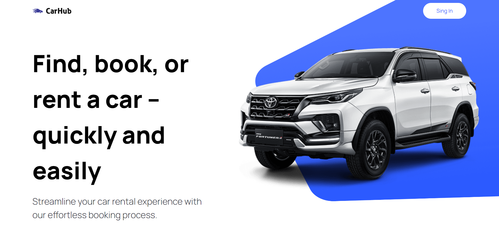
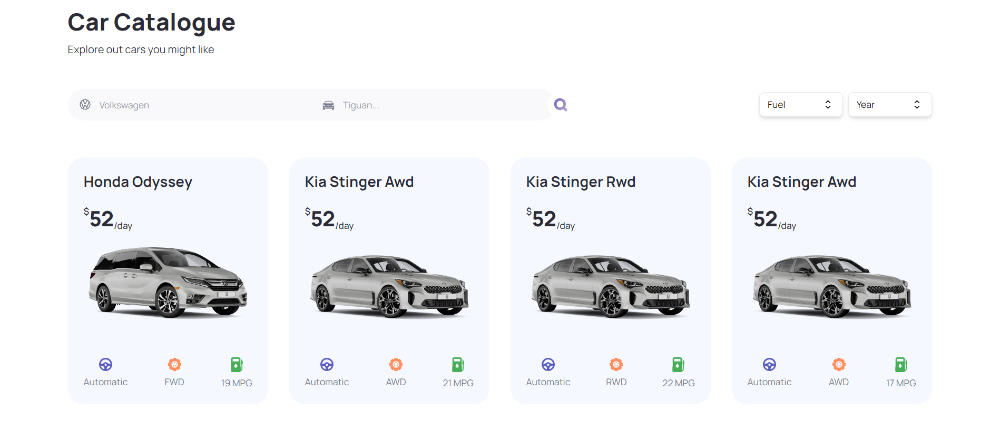

# Car Rental "Car Hub"

## Description

This is the landing page for a car rental service called **"Car Hub**". On this site, visitors can browse through a variety of cars from different brands. Additionally, it provides functionalities to filter vehicles by brand, year of manufacture, or type of fuel, making the selection process easier according to the user's preferences.

## Technologies used

- React
- Next.js 13
- Tailwind CSS
- headless UI

## Screenshots

  
  

## Installation

1. Clone the repository: `https://github.com/peperiqueelmee/Car-Rental-Car-Hub.git`
2. Navigate to the project directory: `cd Car-Rental-Car-Hub`
3. Install the dependencies: `npm install`

## Environment Configuration

To use this application, you need to set up the environment by creating a file named `.env` at the project's root directory. Make sure to follow the structure provided in the `example.env` file. In the `.env` file, you should assign your keys to the following environment variables:

- The `NEXT_PUBLIC_RAPID_API_KEY` key is used to access the car information through the Rapid API. Make sure to obtain a valid key by registering with the Rapid service and copying it to this variable. For more information, visit the [Rapid API Cars by API Ninjas page](https://rapidapi.com/apininjas/api/cars-by-api-ninjas).

- The `NEXT_PUBLIC_IMAGIN_API_KEY` key is used to access the photo service through the Imagin API. You need to register with Imagin to obtain a valid key and then assign it to this variable. For more information, visit the [Imagin Studio Car Image API page](https://www.imagin.studio/car-image-api).

Remember to save the changes in the `.env` file before running the application.

Ensure the confidentiality of your API keys and avoid sharing them publicly. Keep the `.env` file outside of the repository to prevent exposing your keys in a public environment.

## Usage
Once you have completed the previous configurations, you can start the server by running the following command:
`npm run dev`. Once the server is up and running, you can access the application by visiting `http://localhost:3000/` in your web browser.

## Live Demo
You can see the live application at 
[https://car-hub-peperiquelmee.netlify.app/](https://car-hub-peperiquelmee.netlify.app/).